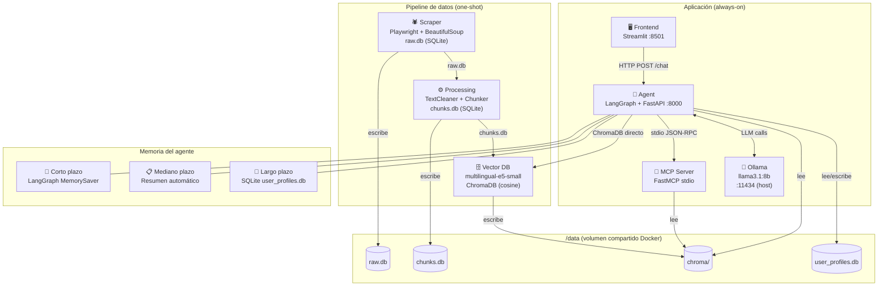

# 🏦 Asistente Virtual Bancolombia — RAG + MCP + LangGraph

Chatbot conversacional para la sección **Personas** del sitio web de Bancolombia, construido con una arquitectura RAG (Retrieval-Augmented Generation) sobre el protocolo MCP (Model Context Protocol). El sistema extrae, procesa e indexa el contenido público del sitio, y expone una interfaz de chat que responde preguntas sobre productos y servicios usando únicamente información oficial.

---

## Diagrama de arquitectura



---

## Estructura del proyecto

```
bancolombia-rag/
├── scraper/          # Capa 1: Web scraping (Playwright)
├── processing/       # Capa 2: Limpieza y chunking
├── vector_db/        # Capa 3: Embeddings + ChromaDB
├── mcp_server/       # Capa 4: Servidor MCP (FastMCP)
├── agent/            # Capa 5: Agente LangGraph + FastAPI
├── frontend/         # Capa 6: UI Streamlit
├── tests/            # Tests unitarios (pytest)
├── docker-compose.yml
├── .env.example
└── .github/workflows/ # CI/CD GitHub Actions
```

---

## Requisitos previos (Windows)

Antes de ejecutar el proyecto en Windows necesitas instalar tres herramientas. Sigue los pasos en orden.

---

### 1. Instalar WSL2 + Docker Desktop

Docker Desktop en Windows requiere WSL2 (Windows Subsystem for Linux 2).

**Paso 1 — Habilitar WSL2** (PowerShell como Administrador):
```powershell
wsl --install
```
Reinicia Windows cuando lo solicite.

**Paso 2 — Descargar e instalar Docker Desktop**

- Ir a [https://www.docker.com/products/docker-desktop](https://www.docker.com/products/docker-desktop)
- Descargar el instalador para Windows
- Ejecutar el `.exe` — el instalador detecta y configura WSL2 automáticamente
- Reiniciar si lo solicita

**Paso 3 — Verificar instalación**
```powershell
docker --version
docker compose version
```
Ambos deben responder con versión. El ícono de la ballena en la barra de tareas debe estar verde.

---

### 2. Instalar Ollama (LLM local)

Ollama corre el modelo de lenguaje directamente en tu máquina, sin necesidad de API keys ni costos.

**Paso 1 — Descargar e instalar Ollama**

- Ir a [https://ollama.com](https://ollama.com)
- Descargar el instalador para Windows y ejecutarlo
- Ollama queda corriendo como servicio en segundo plano en el puerto `11434`

**Paso 2 — Descargar el modelo llama3.1:8b** (~4.9 GB, solo la primera vez):
```powershell
ollama pull llama3.1:8b
```

**Paso 3 — Verificar que el modelo está disponible**
```powershell
ollama list
```
Debe aparecer `llama3.1:8b` en la lista.

> **Nota:** Si `ollama` no se reconoce como comando, busca el ejecutable en:
> `C:\Users\<tu_usuario>\AppData\Local\Programs\Ollama\ollama.exe`
> o reinicia la terminal para que tome el PATH actualizado.

> **Nota:** Si ves el error `listen tcp 127.0.0.1:11434: bind: address already in use`,
> significa que Ollama ya está corriendo como servicio en segundo plano — es correcto, no hay que hacer nada.

---

### 3. Requisitos de hardware recomendados

| Recurso | Mínimo | Recomendado |
|---|---|---|
| RAM | 8 GB | 16 GB |
| Disco libre | 15 GB | 20 GB |
| GPU | No requerida | NVIDIA (acelera el LLM) |
| OS | Windows 10/11 64-bit | Windows 11 |

---

## Instalación y ejecución

### Opción A — Docker (recomendado)

**1. Clonar el repositorio**
```bash
git clone https://github.com/EmanuelVlez/chat-bot-rag-bancolombia.git
cd chat-bot-rag-bancolombia
```

**2. Instalar y arrancar Ollama con el modelo**
```bash
# Descargar Ollama desde https://ollama.com
ollama pull llama3.1:8b
```

**3. Copiar variables de entorno**
```bash
cp .env.example .env
```

**4. Primera vez: ejecutar pipeline completo + levantar app**
```bash
docker compose --profile pipeline --profile app up --build
```

**5. Veces siguientes (ya hay datos indexados)**
```bash
docker compose --profile app up
```

**6. Abrir el asistente**

Navegar a [http://localhost:8501](http://localhost:8501)

---

### Opción B — Ejecución local (sin Docker)

> Requiere Python 3.11+ instalado. Descargarlo desde [https://www.python.org](https://www.python.org).

**1. Clonar el repositorio**
```bash
git clone https://github.com/EmanuelVlez/chat-bot-rag-bancolombia.git
cd chat-bot-rag-bancolombia
```

**2. Instalar dependencias por módulo**
```bash
pip install -r scraper/requirements.txt
pip install -r processing/requirements.txt
pip install -r vector_db/requirements.txt
pip install -r mcp_server/requirements.txt
pip install -r agent/requirements.txt
pip install -r frontend/requirements.txt

# Instalar el navegador Chromium para el scraper (solo la primera vez)
playwright install
```

**3. Ejecutar el pipeline de datos (una vez)**
```bash
# Terminal 1 — scraper
cd scraper && python app/main.py

# Terminal 2 — processing (cuando el scraper termine)
cd processing && python app/main.py

# Terminal 3 — indexación vectorial
cd vector_db && python app/main.py
```

**4. Levantar el agente y el frontend**
```bash
# Terminal 4 — agente (FastAPI)
cd agent && uvicorn app.api:app --port 8000

# Terminal 5 — frontend
# --server.fileWatcherType none evita warnings de torchvision en Windows
cd frontend && streamlit run app/app.py --server.fileWatcherType none
```

---

## Perfiles Docker Compose

| Perfil | Servicios | Cuándo usarlo |
|---|---|---|
| `pipeline` | scraper → processing → vector_db | Primera vez o para re-indexar |
| `app` | agent + frontend | Siempre que quieras usar el chat |

```bash
# Solo re-indexar (los datos cambiaron)
docker compose --profile pipeline up --build

# Solo la app (datos ya indexados)
docker compose --profile app up
```

---

## Variables de entorno

Copiar `.env.example` a `.env` y ajustar si es necesario:

| Variable | Default | Descripción |
|---|---|---|
| `OLLAMA_BASE_URL` | `http://host.docker.internal:11434` | Endpoint de Ollama |
| `OLLAMA_MODEL` | `llama3.1:8b` | Modelo LLM a usar |
| `RAW_DB_PATH` | `/data/raw.db` | Ruta del DB del scraper |
| `CHUNKS_DB_PATH` | `/data/chunks.db` | Ruta del DB de chunks |
| `CHROMA_PATH` | `/data/chroma` | Directorio de ChromaDB |
| `PROFILES_DB_PATH` | `/data/user_profiles.db` | DB de perfiles de usuario |

---

## Decisiones técnicas justificadas

### LLM: Ollama + llama3.1:8b (local)
Se eligió sobre APIs de pago (Claude, GPT-4) para garantizar que cualquier evaluador pueda ejecutar el sistema sin costos ni API keys. `llama3.1:8b` ofrece buen balance entre calidad de respuesta en español y recursos necesarios (8 GB RAM).

### Embeddings: intfloat/multilingual-e5-small (local)
Modelo open-source de 384 dimensiones que soporta español de forma nativa. Requiere prefijo `passage:` al indexar y `query:` al buscar. No tiene costos de API y es suficientemente preciso para el dominio financiero en español.

### Base vectorial: ChromaDB persistente
Elegida sobre Pinecone o Weaviate por ser embebida (sin servidor separado), open-source y con soporte nativo para similitud coseno. Los datos persisten en disco con un simple directorio, facilitando el volumen compartido en Docker.

### Protocolo MCP + FastMCP
El servidor MCP expone la base de conocimiento como capacidades reutilizables (`search_knowledge_base`, `get_article_by_url`, `list_categories`) que cualquier cliente MCP-compatible puede consumir sin conocer los detalles de ChromaDB.

### Framework del agente: LangGraph
Permite modelar el flujo del agente como un grafo de estados con memoria persistente por sesión (`MemorySaver`). Soporta herramientas async (MCP), resumen automático del historial y nodos personalizados para los tres tipos de memoria.

### Transporte MCP: stdio
El agente lanza el servidor MCP como subproceso y se comunica por stdin/stdout. Esto los mantiene en el mismo contenedor Docker evitando latencia de red, y es el transporte obligatorio según la especificación del protocolo.

### Búsqueda forzada en el agente
`llama3.1:8b` en ocasiones responde sin invocar las tools MCP. Para garantizar que **siempre** se use la base de conocimiento oficial, el nodo agente realiza una búsqueda directa en ChromaDB antes de invocar el LLM, inyectando los resultados como contexto. Las fuentes se extraen directamente de ChromaDB (no del texto del LLM).

---

## Limitaciones conocidas

| Limitación | Descripción |
|---|---|
| Cobertura del scraper | Solo indexa páginas de `bancolombia.com/personas`. Secciones dinámicas protegidas con login no son accesibles. |
| Calidad del LLM | `llama3.1:8b` puede alucinar en preguntas fuera de su contexto de entrenamiento. El sistema mitiga esto forzando la búsqueda en ChromaDB. |
| Latencia | Sin GPU, `llama3.1:8b` tarda 15-45 segundos por respuesta en CPU. Con GPU NVIDIA el tiempo baja a 2-5 segundos. |
| Memoria mediano plazo | El resumen automático se activa cada 12 mensajes. Con LLMs pequeños, la calidad del resumen puede ser inconsistente. |
| Idioma | El sistema está optimizado para español. Preguntas en inglés funcionan pero con menor precisión en la recuperación. |
| Ollama en Docker | En Windows con Docker Desktop, Ollama debe correr en el host. La conexión se realiza vía `host.docker.internal:11434`. |

---

## CI/CD

- **CI** (`ci.yml`): linting con `ruff` + 24 tests unitarios en cada push.
- **CD** (`cd.yml`): build de las 5 imágenes Docker + validación de `docker-compose.yml` en cada push a `main`.

```bash
# Ejecutar tests localmente
pip install pytest tiktoken chromadb langchain-text-splitters
pytest tests/ -v
```

---

## Tecnologías utilizadas

| Capa | Tecnología |
|---|---|
| Scraping | Playwright, BeautifulSoup4, aiosqlite |
| Processing | LangChain TextSplitters, tiktoken |
| Embeddings | sentence-transformers (multilingual-e5-small) |
| Vector DB | ChromaDB |
| MCP Server | FastMCP (mcp[cli]) |
| Agente | LangGraph, LangChain MCP Adapters |
| LLM | Ollama + llama3.1:8b |
| API | FastAPI + Uvicorn |
| Frontend | Streamlit |
| Tests | pytest |
| Linting | ruff |
| CI/CD | GitHub Actions |
| Contenedores | Docker, Docker Compose |
