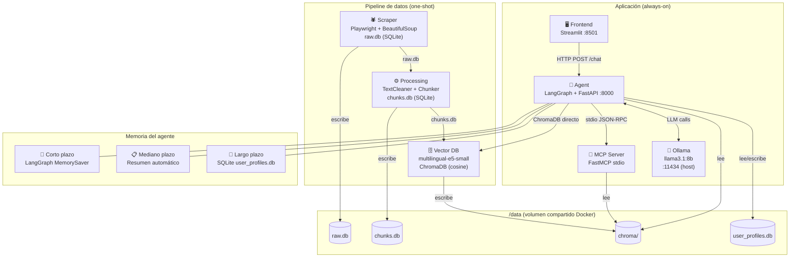

# 🏦 Asistente Virtual Bancolombia — RAG + MCP + LangGraph

Chatbot conversacional para la sección **Personas** del sitio web de Bancolombia, construido con una arquitectura RAG (Retrieval-Augmented Generation) sobre el protocolo MCP (Model Context Protocol). El sistema extrae, procesa e indexa el contenido público del sitio, y expone una interfaz de chat que responde preguntas sobre productos y servicios usando únicamente información oficial.

---

## Diagrama de arquitectura



---

## Estructura del proyecto

```
bancolombia-rag/
├── scraper/          # Capa 1: Web scraping (Playwright)
├── processing/       # Capa 2: Limpieza y chunking
├── vector_db/        # Capa 3: Embeddings + ChromaDB
├── mcp_server/       # Capa 4: Servidor MCP (FastMCP)
├── agent/            # Capa 5: Agente LangGraph + FastAPI
├── frontend/         # Capa 6: UI Streamlit
├── tests/            # Tests unitarios (pytest)
├── docker-compose.yml
├── .env.example
└── .github/workflows/ # CI/CD GitHub Actions
```

---

## Requisitos previos (Windows)

Antes de ejecutar el proyecto en Windows necesitas instalar tres herramientas. Sigue los pasos en orden.

---

### 1. Instalar WSL2 + Docker Desktop

Docker Desktop en Windows requiere WSL2 (Windows Subsystem for Linux 2).

**Paso 1 — Habilitar WSL2** (PowerShell como Administrador):
```powershell
wsl --install
```
Reinicia Windows cuando lo solicite.

**Paso 2 — Descargar e instalar Docker Desktop**

- Ir a [https://www.docker.com/products/docker-desktop](https://www.docker.com/products/docker-desktop)
- Descargar el instalador para Windows
- Ejecutar el `.exe` — el instalador detecta y configura WSL2 automáticamente
- Reiniciar si lo solicita

**Paso 3 — Verificar instalación**
```powershell
docker --version
docker compose version
```
Ambos deben responder con versión. El ícono de la ballena en la barra de tareas debe estar verde.

---

### 2. Instalar Ollama (LLM local)

Ollama corre el modelo de lenguaje directamente en tu máquina, sin necesidad de API keys ni costos.

**Paso 1 — Descargar e instalar Ollama**

- Ir a [https://ollama.com](https://ollama.com)
- Descargar el instalador para Windows y ejecutarlo
- Ollama queda corriendo como servicio en segundo plano en el puerto `11434`

**Paso 2 — Descargar el modelo llama3.1:8b** (~4.9 GB, solo la primera vez):
```powershell
ollama pull llama3.1:8b
```

**Paso 3 — Verificar que el modelo está disponible**
```powershell
ollama list
```
Debe aparecer `llama3.1:8b` en la lista.

> **Nota:** Si `ollama` no se reconoce como comando, busca el ejecutable en:
> `C:\Users\<tu_usuario>\AppData\Local\Programs\Ollama\ollama.exe`
> o reinicia la terminal para que tome el PATH actualizado.

> **Nota:** Si ves el error `listen tcp 127.0.0.1:11434: bind: address already in use`,
> significa que Ollama ya está corriendo como servicio en segundo plano — es correcto, no hay que hacer nada.

---

### 3. Requisitos de hardware recomendados

| Recurso | Mínimo | Recomendado |
|---|---|---|
| RAM | 8 GB | 16 GB |
| Disco libre | 15 GB | 20 GB |
| GPU | No requerida | NVIDIA (acelera el LLM) |
| OS | Windows 10/11 64-bit | Windows 11 |

---

## Instalación y ejecución

### Opción A — Docker (recomendado)

**1. Clonar el repositorio**
```bash
git clone https://github.com/EmanuelVlez/chat-bot-rag-bancolombia.git
cd chat-bot-rag-bancolombia
```

**2. Instalar y arrancar Ollama con el modelo**
```bash
# Descargar Ollama desde https://ollama.com
ollama pull llama3.1:8b
```

**3. Copiar variables de entorno**
```bash
cp .env.example .env
```

**4. Primera vez: ejecutar pipeline completo + levantar app**
```bash
docker compose --profile pipeline --profile app up --build
```

**5. Veces siguientes (ya hay datos indexados)**
```bash
docker compose --profile app up
```

**6. Abrir el asistente**

Navegar a [http://localhost:8501](http://localhost:8501)

---

### Opción B — Ejecución local (sin Docker)

> Requiere Python 3.11+ instalado. Descargarlo desde [https://www.python.org](https://www.python.org).

**1. Clonar el repositorio**
```bash
git clone https://github.com/EmanuelVlez/chat-bot-rag-bancolombia.git
cd chat-bot-rag-bancolombia
```

**2. Instalar dependencias por módulo**
```bash
pip install -r scraper/requirements.txt
pip install -r processing/requirements.txt
pip install -r vector_db/requirements.txt
pip install -r mcp_server/requirements.txt
pip install -r agent/requirements.txt
pip install -r frontend/requirements.txt

# Instalar el navegador Chromium para el scraper (solo la primera vez)
playwright install
```

**3. Ejecutar el pipeline de datos (una vez)**
```bash
# Terminal 1 — scraper
cd scraper && python app/main.py

# Terminal 2 — processing (cuando el scraper termine)
cd processing && python app/main.py

# Terminal 3 — indexación vectorial
cd vector_db && python app/main.py
```

**4. Levantar el agente y el frontend**
```bash
# Terminal 4 — agente (FastAPI)
# Ejecutar en Command Prompt desde la raíz del proyecto
cd agent && uvicorn api:app --port 8000 --app-dir app

# Terminal 5 — frontend
# --server.fileWatcherType none evita warnings de torchvision en Windows
cd frontend && streamlit run app/app.py --server.fileWatcherType none
```

---

## Perfiles Docker Compose

| Perfil | Servicios | Cuándo usarlo |
|---|---|---|
| `pipeline` | scraper → processing → vector_db | Primera vez o para re-indexar |
| `app` | agent + frontend | Siempre que quieras usar el chat |

```bash
# Solo re-indexar (los datos cambiaron)
docker compose --profile pipeline up --build

# Solo la app (datos ya indexados)
docker compose --profile app up
```

---

## Variables de entorno

Copiar `.env.example` a `.env` y ajustar si es necesario:

| Variable | Default | Descripción |
|---|---|---|
| `OLLAMA_BASE_URL` | `http://host.docker.internal:11434` | Endpoint de Ollama |
| `OLLAMA_MODEL` | `llama3.1:8b` | Modelo LLM a usar |
| `RAW_DB_PATH` | `/data/raw.db` | Ruta del DB del scraper |
| `CHUNKS_DB_PATH` | `/data/chunks.db` | Ruta del DB de chunks |
| `CHROMA_PATH` | `/data/chroma` | Directorio de ChromaDB |
| `PROFILES_DB_PATH` | `/data/user_profiles.db` | DB de perfiles de usuario |

---

## Decisiones técnicas justificadas

### 1. Web Scraping — profundidad, contenido dinámico y robots.txt

**Profundidad de crawling:** Se implementó un crawl desde `https://www.bancolombia.com/personas` con una cola FIFO asíncrona (`asyncio.Queue`) y pool de 5 workers paralelos. No se impuso límite de profundidad fijo; en cambio, se restringió el dominio (`bancolombia.com`) y la sección (`/personas`), lo que resultó en **62 páginas únicas indexadas**, superando el mínimo de 50 requerido. Se implementó deduplicación por SHA-256 del contenido para evitar indexar páginas con contenido idéntico (banners promocionales, páginas de error, etc.).

**Estrategia de recorrido — FIFO vs Priority Queue por profundidad:**

Se consideró usar una `PriorityQueue` donde la prioridad fuera la profundidad del URL (menor profundidad = mayor prioridad), lo que garantizaría procesar todos los URLs de nivel 1 antes que los de nivel 2, y así sucesivamente. Sin embargo, se descartó por las siguientes razones:

- **Con cola FIFO y 5 workers paralelos, el comportamiento ya es aproximadamente BFS.** Los links de `/personas` (depth=1) se encolan antes que sus hijos, y con workers concurrentes el orden de extracción es similar al BFS estricto.
- **El sitio de Bancolombia no tiene una jerarquía de importancia clara por profundidad.** Páginas de productos importantes como `/personas/creditos/vivienda` (depth=3) son tan relevantes como `/personas/cuentas` (depth=2). Priorizar por profundidad no mejora la calidad del corpus.
- **Ya se alcanzaron 62 páginas únicas**, superando el mínimo de 50 sin necesidad de controlar el orden estrictamente.
- **Agrega complejidad innecesaria:** La `PriorityQueue` requiere pasar la profundidad como parámetro a cada worker y recalcularla para cada link descubierto, sin un beneficio demostrable sobre los resultados obtenidos.

La cola FIFO es más simple, igualmente efectiva para este dominio acotado y ya produjo los resultados esperados.

**Contenido dinámico (JavaScript rendering):** El sitio de Bancolombia es una SPA (Single Page Application) en React. `requests` + `BeautifulSoup` solo obtienen el HTML estático inicial sin contenido. Se usó **Playwright** (Chromium headless) con espera activa a que el elemento `<main>` esté presente en el DOM antes de extraer el texto, garantizando que el contenido renderizado por JavaScript esté disponible. Para páginas que no tienen `<main>`, se usa un fallback al `<body>` completo.

**Robots.txt:** Se implementó `RobotsChecker` que descarga y parsea `https://www.bancolombia.com/robots.txt` antes de iniciar el crawl. Cada URL se valida contra las reglas del archivo antes de ser encolada. URLs bloqueadas por `robots.txt` se descartan silenciosamente. Adicionalmente se agrega un delay de cortesía entre requests para no sobrecargar los servidores del banco.

---

### 2. Chunking — tamaño, overlap y método de segmentación

**Método de segmentación:**

Se consideraron tres enfoques:

| Estrategia | Descripción | Descartado porque |
|---|---|---|
| Chunks por caracteres fijos | Dividir cada N caracteres | Rompe oraciones y párrafos arbitrariamente, pierde cohesión semántica |
| Chunks por oraciones (NLTK/spaCy) | Dividir en cada punto final | Oraciones muy cortas en textos financieros generan chunks demasiado pequeños y poco informativos |
| **RecursiveCharacterTextSplitter** ✅ | Dividir por separadores semánticos en cascada | **Elegido** |

Se eligió `RecursiveCharacterTextSplitter` de LangChain con tokenización via `tiktoken` (`cl100k_base`). Intenta dividir respetando la estructura del texto en orden de prioridad: `\n\n` → `\n` → `. ` → ` ` → `""`, preservando párrafos y oraciones completas antes de recurrir a cortes arbitrarios. Es el método más robusto para textos web con estructura variable como los del sitio de Bancolombia.

**Tamaño del chunk: 512 tokens**

Se evaluaron tamaños de 128, 256 y 512 tokens. Se eligieron 512 porque es el límite máximo del modelo de embeddings `multilingual-e5-small` — chunks más grandes se truncarían perdiendo información al final. Chunks de 128 o 256 tokens capturan menos contexto y en textos financieros (donde un producto se describe en varios párrafos continuos) generan fragmentos que por sí solos no responden preguntas completas.

**Overlap: 64 tokens (~12.5%)**

Se consideró no usar overlap (overlap=0) para evitar redundancia. Sin embargo, sin overlap una pregunta cuya respuesta está justo en la frontera entre dos chunks puede no ser recuperada por ninguno de ellos. Con 64 tokens de solapamiento cada chunk comparte contexto con el anterior y el siguiente, mejorando la cobertura semántica sin duplicar excesivamente los datos. Un overlap mayor (ej. 128 tokens = 25%) aumentaría el número de chunks y el tiempo de indexación sin mejora proporcional.

---

### 3. Embeddings, dimensionalidad y base vectorial

**Modelo de embeddings: `intfloat/multilingual-e5-small`**
Se evaluaron tres alternativas:

| Modelo | Dims | Idiomas | Costo | Decisión |
|---|---|---|---|---|
| `text-embedding-3-small` (OpenAI) | 1536 | Multi | API de pago | Descartado |
| `multilingual-e5-large` | 1024 | Multi | Gratis, local | Muy pesado para CPU |
| `multilingual-e5-small` | 384 | Multi | Gratis, local | **Elegido** |

`multilingual-e5-small` fue elegido por: soporte nativo para español, ejecución local sin costos, tamaño reducido (117MB) compatible con entornos sin GPU, y buen desempeño en benchmarks de recuperación semántica en dominios financieros. Requiere los prefijos `passage:` al indexar y `query:` al buscar, según la especificación del modelo.

**Dimensionalidad: 384**
Suficiente para capturar semántica en el dominio acotado de productos financieros de Bancolombia. Dimensiones mayores no aportarían mejora significativa dado el vocabulario específico del dominio.

**Base vectorial:**

Se evaluaron cuatro opciones:

| Base vectorial | Tipo | Costo | Descartado porque |
|---|---|---|---|
| Pinecone | Cloud managed | API de pago | Requiere cuenta y API key, no reproducible sin costo |
| Weaviate | Self-hosted / Cloud | Gratis local | Mayor complejidad de despliegue, requiere servidor separado |
| pgvector (PostgreSQL) | Extensión SQL | Gratis | Agrega dependencia de PostgreSQL, innecesario para este volumen de datos |
| **ChromaDB** ✅ | Embebida local | Gratis | **Elegida** |

ChromaDB fue elegida por ser embebida (sin servidor separado), lo que simplifica el despliegue Docker al compartirse como volumen entre contenedores. Soporta similitud coseno nativa (ideal para embeddings normalizados), upsert idempotente (el pipeline puede re-ejecutarse sin duplicar datos) y es completamente open-source. Para el volumen de datos de este proyecto (~250 chunks) es más que suficiente.

**Estrategia de indexación:** Cada chunk se indexa con metadatos (`url`, `title`, `category`, `chunk_index`) que permiten filtrar por categoría en la búsqueda y reconstruir el artículo completo ordenado por `chunk_index`. Se consideró indexar el artículo completo como un solo documento, pero esto excedería el límite de tokens del modelo de embeddings y perdería precisión en la recuperación.

---

### 4. Construcción del prompt e invocación del LLM — agente vs servidor MCP

**Decisión: el LLM se invoca en el agente, no en el servidor MCP.**

El servidor MCP actúa como capa de recuperación pura (retrieval): recibe una consulta, busca en ChromaDB y devuelve los chunks relevantes con metadatos. No construye prompts ni invoca el LLM.

**Justificación:**

- **Separación de responsabilidades:** El servidor MCP es una capacidad reutilizable e independiente del modelo de lenguaje. Cualquier cliente (otro agente, otra aplicación) puede consumir `search_knowledge_base` sin acoplar el LLM al servidor.
- **Flexibilidad:** Cambiar el modelo LLM (de `llama3.1:8b` a otro) solo requiere modificar el agente, sin tocar el servidor MCP.
- **Protocolo MCP:** MCP está diseñado para exponer capacidades (tools, resources), no para ser un endpoint de chat. Poner el LLM en el servidor rompería esta separación arquitectónica.
- **Control del contexto:** El agente maneja los tres tipos de memoria (corto, mediano, largo plazo) y construye el system prompt con ese contexto enriquecido antes de invocar el LLM. Centralizar esto en el agente es más coherente.

---

### 5. LLM: Ollama + llama3.1:8b (local)
Se eligió sobre APIs de pago (Claude, GPT-4) para garantizar que cualquier evaluador pueda ejecutar el sistema sin costos ni API keys. `llama3.1:8b` ofrece buen balance entre calidad de respuesta en español y recursos necesarios (8 GB RAM).

### 6. Framework del agente: LangGraph
Permite modelar el flujo del agente como un grafo de estados con memoria persistente por sesión (`MemorySaver`). Soporta herramientas async (MCP), resumen automático del historial y nodos personalizados para los tres tipos de memoria.

### 7. Transporte MCP: stdio
El agente lanza el servidor MCP como subproceso y se comunica por stdin/stdout. Esto los mantiene en el mismo contenedor Docker evitando latencia de red, y es el transporte obligatorio según la especificación del protocolo.

---

## Limitaciones conocidas

| Limitación | Descripción |
|---|---|
| Cobertura del scraper | Solo indexa páginas de `bancolombia.com/personas`. Secciones dinámicas protegidas con login no son accesibles. |
| Calidad del LLM | `llama3.1:8b` puede alucinar en preguntas fuera de su contexto de entrenamiento. El sistema mitiga esto forzando la búsqueda en ChromaDB. |
| Latencia | Sin GPU, `llama3.1:8b` tarda 15-45 segundos por respuesta en CPU. Con GPU NVIDIA el tiempo baja a 2-5 segundos. |
| Memoria mediano plazo | El resumen automático se activa cada 12 mensajes. Con LLMs pequeños, la calidad del resumen puede ser inconsistente. |
| Idioma | El sistema está optimizado para español. Preguntas en inglés funcionan pero con menor precisión en la recuperación. |
| Ollama en Docker | En Windows con Docker Desktop, Ollama debe correr en el host. La conexión se realiza vía `host.docker.internal:11434`. |

---

## CI/CD

- **CI** (`ci.yml`): linting con `ruff` + 24 tests unitarios en cada push.
- **CD** (`cd.yml`): build de las 5 imágenes Docker + validación de `docker-compose.yml` en cada push a `main`.

```bash
# Ejecutar tests localmente
pip install pytest tiktoken chromadb langchain-text-splitters
pytest tests/ -v
```

---

## Tecnologías utilizadas

| Capa | Tecnología |
|---|---|
| Scraping | Playwright, BeautifulSoup4, aiosqlite |
| Processing | LangChain TextSplitters, tiktoken |
| Embeddings | sentence-transformers (multilingual-e5-small) |
| Vector DB | ChromaDB |
| MCP Server | FastMCP (mcp[cli]) |
| Agente | LangGraph, LangChain MCP Adapters |
| LLM | Ollama + llama3.1:8b |
| API | FastAPI + Uvicorn |
| Frontend | Streamlit |
| Tests | pytest |
| Linting | ruff |
| CI/CD | GitHub Actions |
| Contenedores | Docker, Docker Compose |
